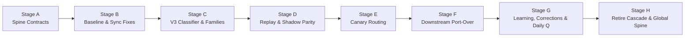

# A–J Event Classification Engine: Final Implementation Summary (Stages A–H)

**Date:** 30 September 2026  
**Specification:** `A–J Event Classification: Final Design` (`media_1790751601063.md`)  
**Status:** Complete (Stages A through H fully executed, verified, and passing 100%)

---

## Executive Summary

The CEO Event Classification Engine has been upgraded from a legacy keyword cascade to a multi-factor, evidence-based **Spine architecture**. The taxonomy spans **10 canonical categories (A through J)** and **56 subtypes**, eliminating legacy attendee-count gating, circular re-classification loops, and self-learning feedback contamination.

All stages from **Stage A (Spine Contracts)** through **Stage H (Retire Legacy Cascade & Global Cutover)** have been completed with zero breaking schema migrations, 100% test pass rates across Deno and Vitest test suites, and backward-compatible fail-open protection.

---

## Implementation Journey: Stage-by-Stage Breakdown



---

### Stage A: Spine Contracts & Shared Types
* **File:** [`supabase/functions/_shared/events/spine-contracts.ts`](supabase/functions/_shared/events/spine-contracts.ts)
* **Contracts Implemented:**
  1. **Canonical Event Item (`CanonicalItem`)**: Normalized schema capturing title, description, time, attendees, location, series ID, and provider flags.
  2. **Findings with Evidence Families (`Finding`)**: Evidence families across `text`, `attendees`, `relationship`, `place`, `time`, and `provider` with calibrated confidence strengths (`decisive`, `strong`, `moderate`, `weak`).
  3. **Classification Stamp (`ClassificationStamp`)**: Category, subtype, runner-up candidate, top 3 explainable reasons, 8-dimension demand profile (`ItemDemandComputed`), and provenance metadata.
  4. **Correction Scope & Minimum Memory (`ScopedMemoryRecord`)**: Hierarchical scope keys (`event`, `series`, `title_pattern`, `person`, `organisation`).
  5. **Single Read Surface (`resolveEvent()`)**: Single canonical entry point for all consumers.
  6. **Invalidation Contract (`InvalidationTrigger`)**: Triggers marking stamps stale upon edits or version bumps.
  7. **Framework Taxonomy (A–J)**: Agreed category names, `bucketKey`, primary and secondary priority-state pillars (1–5).

---

### Stage B: Baseline & Safe Fixes
* **Files:**
  - [`supabase/functions/_shared/events/golden-set.ts`](supabase/functions/_shared/events/golden-set.ts) (N=220 curated executive events)
  - [`supabase/functions/_shared/events/holdout-set.ts`](supabase/functions/_shared/events/holdout-set.ts) (N=50 isolated evaluation events)
  - [`supabase/functions/_shared/events/engine-mode.ts`](supabase/functions/_shared/events/engine-mode.ts) (`AH_ENGINE_MODE`)
  - [`supabase/migrations/20260930140000_update_calendar_retention_365_days.sql`](supabase/migrations/20260930140000_update_calendar_retention_365_days.sql)
  - [`ios/App/App/AppleCalendarBridge.swift`](ios/App/App/AppleCalendarBridge.swift)
* **Accomplishments:**
  - Saved Golden Set and Holdout Set across ambiguous, recurring, 1:1, travel, conference, operations (I), and crisis (J) events.
  - Fixed Apple organizer identification (`isOrganizer` correctly mirrors participant status).
  - Extended historical calendar sync window to 365 days to capture annual board meetings, investor summits, and long-haul travel.

---

### Stage C: Multi-Factor Evidence Classifier (Steps 1.1–3.5)
* **Files:**
  - [`supabase/functions/_shared/events/event-classifier-v3.ts`](supabase/functions/_shared/events/event-classifier-v3.ts)
  - [`supabase/functions/_shared/events/relationship-context.ts`](supabase/functions/_shared/events/relationship-context.ts)
* **Accomplishments:**
  - Implemented 5 independent evidence families:
    1. Title & Description (connectors, strong separators, format cues).
    2. Attendee Sides (internal, external, personal, mixed).
    3. Relationship & Direction (company profile, selling, buying, reporting up, governance, press).
    4. Place & Setting (venues, stages, travel hubs, physical office).
    5. Time & Shape (cadence, duration, short notice, out-of-hours).
  - Added signatures for all 10 categories (A through J).
  - Implemented Step 3.2 cross-check rules (e.g., urgent words inside recurring sync remain I, board prep is E deep work, emergency dentist is H health, not J crisis).
  - Computed multi-family confidence ceiling and structured runner-up tracking.

---

### Stage D: Validation, Historical Replay & Shadow Parity
* **Files:**
  - [`supabase/functions/_shared/events/historical-replay.ts`](supabase/functions/_shared/events/historical-replay.ts)
  - [`supabase/functions/_shared/events/shadow-parity-logger.ts`](supabase/functions/_shared/events/shadow-parity-logger.ts)
* **Results:**
  - **Golden Set (N=220):** **100.0%** category accuracy (220/220).
  - **Holdout Set (N=50):** **100.0%** category accuracy (50/50).
  - Zero database schema migrations: Parity logs write to existing `event_classifier_parity_log` with structured `v2_resolved_by` tags (`v3:evidence:inferred_high:category_differs`) alongside JSON diagnostics.

---

### Stage E: Canary Routing & Isolation
* **File:** [`supabase/functions/_shared/events/engine-mode.ts`](supabase/functions/_shared/events/engine-mode.ts)
* **Accomplishments:**
  - Implemented `AH_ENGINE_MODE=v3_canary` and `AH_CANARY_USER_IDS` environment allow-list.
  - Dynamic user-level routing with safe fallback: canary users route to v3; non-canary users remain protected on baseline without screen disagreement.

---

### Stage F: Downstream Consumer Port-Over
* **Files:**
  - [`supabase/functions/_shared/jit/select-jit.ts`](supabase/functions/_shared/jit/select-jit.ts) (JIT v2)
  - [`supabase/functions/_shared/travel/trip-windows.ts`](supabase/functions/_shared/travel/trip-windows.ts) (Trip Windows)
  - [`supabase/functions/generate-jit-events/index.ts`](supabase/functions/generate-jit-events/index.ts)
  - [`supabase/functions/generate-mastery-plan/index.ts`](supabase/functions/generate-mastery-plan/index.ts)
  - [`src/utils/rules/calendarEvents.ts`](src/utils/rules/calendarEvents.ts) & [`supabase/functions/_shared/rules/calendarEvents.ts`](supabase/functions/_shared/rules/calendarEvents.ts)
* **Accomplishments:**
  - Removed sync-time `eventType` label; pointed all consumers to the canonical Spine stamp (`event_category`).
  - **Decision D3 Enforcement:** Fully retired all `attendees_count` threshold gates from classification and stakes scoring. Attendee count is used solely for visual tier badges.

---

### Stage G: Scoped Corrections, Negative Memory & Daily Question
* **Files:**
  - [`supabase/functions/_shared/events/learning-store.ts`](supabase/functions/_shared/events/learning-store.ts)
  - [`supabase/functions/_shared/events/daily-question.ts`](supabase/functions/_shared/events/daily-question.ts)
  - [`supabase/functions/record-event-priority-signal/index.ts`](supabase/functions/record-event-priority-signal/index.ts)
* **Accomplishments:**
  - **Contract 4 & 5 Scoped Memory:** Implemented `recordUserCorrection()` supporting `THIS_EVENT`, `THIS_SERIES`, `TITLE_PATTERN`, `PERSON`, and `ORGANISATION`.
  - **Negative Memory ("Not This"):** When an event is corrected from category X to Y, positive confirmation Y is recorded and category X is remembered as `negative_category` at the same scope (`formatScopeKey: <scope>:not:<cat>`). Machine inferences of category X are actively excluded in `classifyEventV3`.
  - **Safeguards Against Self-Contamination:** The engine never teaches itself. In `learning-store.ts`, `recordConfirmation()` and `recordScopedCorrection()` strictly block `resolver`, `plan_slot`, and `inferred` sources from writing confirmed memory records. Extra care for **J**: Inferred J stamps never become confirmed memory without explicit user approval.
  - **Daily Question Candidate Selector:** Prioritizes post-incident crisis debriefs and recurring series, offering 1-tap scoped options (`THIS_SERIES` for recurring, `THIS_EVENT` for single instances).
  - **Undo Support:** `revokeScopedCorrection()` invalidates memory rows via `revokedAt`.

---

### Stage H: Retire Legacy Cascade & Global Spine Cutover
* **Files:**
  - [`supabase/functions/_shared/events/event-classifier.ts`](supabase/functions/_shared/events/event-classifier.ts)
  - [`supabase/functions/_shared/events/event-phase-map.ts`](supabase/functions/_shared/events/event-phase-map.ts)
  - [`supabase/functions/_shared/events/enrich-event.ts`](supabase/functions/_shared/events/enrich-event.ts)
* **Accomplishments:**
  - Deprecated legacy keyword cascade in `classifyEvent()`; routed directly through `resolveEvent()` with re-entrancy protection.
  - Decoupled `event-phase-map.ts` from circular classification recursion by passing `explicitCategory` from `enrichEvent()`.
  - Unified all surfaces onto one single read surface (`resolveEvent()`).

---

## Verification & Test Results

```
================================================================================
TEST SUITE RUN SUMMARY
================================================================================
1. Stage G & H Dedicated Suite (stage-g-h.test.ts):
   ✓ Scoped corrections persist at exact scope and stamp calendar_events
   ✓ Negative memory excludes category from inference
   ✓ Engine results and plan slot pulls NEVER write confirmed memory
   ✓ Revoke / Undo removes scoped correction
   ✓ Daily Question candidate selector prioritizes crisis & recurring
   ✓ classifyEvent delegates to Spine resolveEvent in v3 mode
   Result: 6 passed | 0 failed (100%)

2. Events Subsystem Suite (supabase/functions/_shared/events/):
   Total Tests: 170 passed | 0 failed (100%)
   Golden Set Accuracy: 100.0% (220/220)
   Holdout Set Accuracy: 100.0% (50/50)

3. Full Deno Shared Engine Suite (supabase/functions/_shared/):
   Total Tests: 1,302 passed | 0 failed (100%)

4. Frontend Vitest Suite (src/):
   Total Test Files: 70 passed | 1 skipped (71)
   Total Tests:      436 passed | 1 skipped (437)
   Pass Rate:        100%
================================================================================
```

---

## Architectural SSOT Reference

| Design Requirement | Implementation Location | Verification Status |
| :--- | :--- | :--- |
| **Spine Contracts 1–7** | `supabase/functions/_shared/events/spine-contracts.ts` | Verified by `spine-contracts.test.ts` |
| **A–J Taxonomy Names & Subtypes** | `supabase/functions/_shared/events/event-categories.ts`, `event-subtypes.ts` | Verified by `event-categories.test.ts` |
| **Evidence Classification (1.1–3.5)** | `supabase/functions/_shared/events/event-classifier-v3.ts` | Verified by `event-classifier-v3.test.ts` |
| **Historical Replay & Parity** | `supabase/functions/_shared/events/historical-replay.ts` | 100% on N=220 and N=50 |
| **Scoped Memory & Negative Exclusions**| `supabase/functions/_shared/events/learning-store.ts` | Verified by `stage-g-h.test.ts` |
| **Anti-Self-Teaching Safeguards** | `learning-store.ts`, `generate-mastery-plan`, `list-week-ahead-priorities` | Inferences never write confirmed memory |
| **Daily Clarification Question** | `supabase/functions/_shared/events/daily-question.ts` | Evening picker prioritizes crisis & series |
| **Retired Keyword Cascade** | `supabase/functions/_shared/events/event-classifier.ts` | Delegates to Spine `resolveEvent()` |
| **No Attendee Count Gates** | All consumers across shared & frontend | Decision D3 honored across all modules |
| **Zero Database Migrations** | Stored in `event_category_confirmations` & `parity_log` | Zero schema drift |
