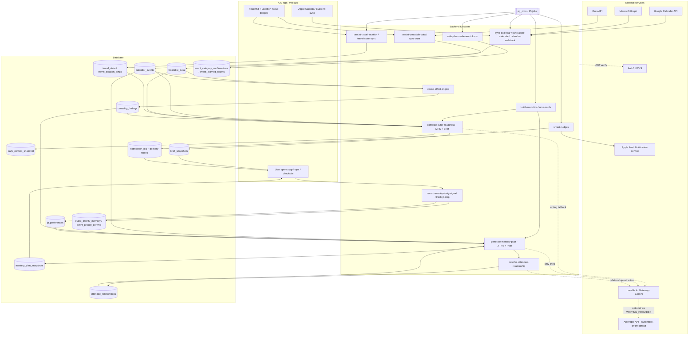

# ALGORITHM_SPEC — MindModule

Status: **Parts 1–2 of 7** written (System overview + Importance weighting; JIT v2).
Scope: describes what the code does **as of the repository snapshot read on 2026‑10‑10**. No application code was modified to produce this document.

Labels used throughout:
- `[UNCERTAIN]` — could not be fully confirmed from code.
- `[DEAD CODE]` — defined but never reached on any live path.
- `[FLAGGED: <name>]` — behaviour depends on an environment flag.
- `[EXCLUDED: JIT v1]` — legacy JIT v1 code; named only, not documented (per instruction).
- `[DISCREPANCY]` — a comment, document or name disagrees with what the code does. The code is described as authoritative.

Citation format: `path:line` or `path › functionName`. Paths are relative to the repo root. Backend shared modules live under `supabase/functions/_shared/` (abbreviated `_shared/`).

---

## 0. Inventory confirmations (answers to the pre-start review)

### 0.1 Scheduled jobs — reconciled (15)

The earlier table merged the two `build-executive-home-cards` jobs into one row. That is why it showed 14 rows for a count of 15. Read live from `cron.job` on 2026‑10‑10. All 15 are `active = true`. Times are UTC.

| # | jobname | schedule | Meaning |
|---|---|---|---|
| 1 | build-executive-home-cards | `*/15 * * * *` | every 15 min |
| 2 | build-executive-home-cards-morning | `30 4 * * *` | 04:30 daily |
| 3 | calendar-events-cleanup-nightly | `0 4 * * *` | 04:00 daily |
| 4 | cleanup-device-tokens-daily | `17 3 * * *` | 03:17 daily |
| 5 | connection-recovery-push-daily | `0 10 * * *` | 10:00 daily |
| 6 | daytime-device-sync | `5 */2 * * *` | minute 5 of every 2nd hour |
| 7 | early-morning-sync | `*/15 * * * *` | every 15 min |
| 8 | install-signup-reminder-daily | `0 11 * * *` | 11:00 daily |
| 9 | oura-sync-every-15m | `*/15 * * * *` | every 15 min |
| 10 | refresh-calendar-tokens | `*/10 * * * *` | every 10 min |
| 11 | register-calendar-watch-daily | `0 3 * * *` | 03:00 daily |
| 12 | rollup-learned-event-tokens | `10 3 * * *` | 03:10 daily |
| 13 | smart-nudges-every-15m | `*/15 * * * *` | every 15 min |
| 14 | sync-calendar-scheduled | `*/30 * * * *` | every 30 min |
| 15 | travel-state-sync-hourly | `0 * * * *` | top of every hour |

`process-orphaned-sessions` (every 10 min) is **not** scheduled. It was unscheduled when the coach was disabled; see `_shared/coach-flag.ts:8-9`, whose comment notes that it must be rescheduled if the coach is re-enabled. The command bodies of each job (target URL and auth header) are documented in Part 6.

### 0.2 What JIT v2 is made of, and which callers use it

"JIT" means *just‑in‑time*: picking the upcoming calendar events that deserve a preparation practice. In this codebase there are three scoring implementations:

| Implementation | Location | Status | Evidence |
|---|---|---|---|
| **JIT v2 triangulated selector** `selectJitCandidates()` | `_shared/jit/select-jit.ts:415-661` | **LIVE** | Called on the live path of `generate-mastery-plan` (`index.ts:3686` via `buildPreferredJitV2Selection`, gated by the hard-coded constant `JIT_V2_LIVE = true` at `index.ts:6274`). Also called by `list-week-ahead-priorities/index.ts:453`. |
| Legacy ranker `rankJitCandidates()` | `_shared/events/jit-candidates.ts:154` | `[EXCLUDED: JIT v1]` | Comment at `generate-mastery-plan/index.ts:6261-6263`: "Legacy ranker (rankJitCandidates) is no longer used in the live plan generation path". A repo-wide search finds no call site, only its definition and comments. |
| Four-dimension scorer (Dim A–D, readiness amplifier, two-touch horizons) | `supabase/functions/generate-jit-events/index.ts` | `[EXCLUDED: JIT v1]` | It does not import `_shared/jit/*`. No frontend, iOS, Android, cron job or other function invokes it. The only other mention is a comment in `_shared/brief-context.ts:3`. The function is still deployed. `[UNCERTAIN]` whether any external client calls it; none exists in the repo. |

**Files that make up JIT v2.** Code shared with v1 is included in v2 here, as you instructed.

| File | Role in v2 |
|---|---|
| `_shared/jit/select-jit.ts` | The only place where Immediate, Tactical and Strategic combine into `importance`. |
| `_shared/jit/relationship-weights.ts` | Attendee role weights, confidence multipliers, domain heuristic. |
| `_shared/jit/relationship-taxonomy.ts` | Base weight per relationship role. |
| `_shared/jit/tactical-signals.ts` | Pattern hit, focus tag, skip penalty, follow-through boost, sovereign tag. |
| `_shared/jit/goal-alignment.ts` | Strategic goal score and protect-goal multiplier. |
| `_shared/jit/maturity-tier.ts` | T0–T3 tier weights. |
| `_shared/jit/noise-filters.ts` | Hard exclusion of personal events. |
| `_shared/jit/load-jit-context.ts` | Reads the database and builds the selector's inputs. |
| `_shared/jit/slot-allocator.ts` | Turns ranked candidates into the 3 daily plan slots (Part 2). |
| `_shared/jit/custom-tag-router.ts` | Routes free-text user tags. Only used by `record-event-priority-signal`. |
| `_shared/plan/event-priority-memory.ts` | Memory delta. |
| `_shared/plan/exclusion-evaluator.ts` | "Never" and "not this week" exclusions, plus recurring demotion. |
| `_shared/plan/exclusion-scope.ts` | Maps each signal to its scope. |
| `_shared/plan/day-of-horizon.ts` | 24-hour horizon constant. |
| `_shared/events/jit-candidates.ts` | **Only its `RankedJitCandidate` type** is used by v2 (imported by `slot-allocator.ts:1`). The `rankJitCandidates` function in the same file is `[EXCLUDED: JIT v1]`. |
| `_shared/events/enrich-event.ts`, `resolve-event-category.ts`, `pattern-bucket.ts`, `event-classifier.ts` (only `SUBTYPE_TO_LEGACY_BUCKET`) | Category and bucket resolution used inside v2. Fully documented in Part 4. |
| `supabase/functions/record-event-priority-signal/index.ts` | Writes the user signals v2 reads. |
| `supabase/functions/track-jit-skip/index.ts` | Writes `jit_preferences`, which v2 reads. Detail in Part 4. |

**Shadow switch `[FLAGGED: JIT_V2]`.** `generate-mastery-plan/index.ts:6616-6623` reads the env var `JIT_V2`. If it is set to anything other than `""`, `off`, `false` or `0`, a second, non-blocking v2 run (`runJitV2Shadow`, which calls `selectJitCandidates` at `index.ts:826`) writes shadow diagnostics. This switch does **not** decide the live ranking. The live ranking is fixed by `JIT_V2_LIVE = true`, a constant in the code that the env var cannot override. A `JIT_V2` secret exists in the project. Its value was not read, as instructed for secrets, so whether shadow runs are currently on is `[UNCERTAIN]`.

### 0.3 Other versioned components (detail in Parts 3 and 4)

- **Event classifier.** The env var `AH_ENGINE_MODE` (`_shared/events/engine-mode.ts:11-23`) can be `legacy` (the default when unset), `shadow`, `v3_canary` (an allow-list in `AH_CANARY_USER_IDS`) or `v3`. Both are secrets that were not read, so the live mode is stated in Part 4 from code paths and logs.
- **MRS.** v4 is the live readiness score. Earlier versions are covered in Part 3.

---

## 1. System overview

### 1.1 Plain-English description

MindModule reads a user's **calendar** (Google, Microsoft or Apple), **body signals** (Apple HealthKit or Oura: heart-rate variability, resting heart rate, sleep), **self-reported check-ins**, **location** (to detect travel) and **stored learning** (past taps, skips, category confirmations, cause-and-effect findings). From these it computes:

1. a **Mind Readiness Score (MRS, 0–100)** for the current time window (morning, afternoon or evening);
2. a day classification: light day, travel, conference, packed, and so on;
3. an **importance ranking** of upcoming events (JIT v2);
4. a **Daily Plan** of 3 practice slots anchored to the highest-ranked events;
5. a **Brief**, a short written readiness narrative;
6. **Smart Nudges**, scheduled push notifications.

Most decisions are deterministic code inside backend functions. A language model (Gemini via the Lovable AI Gateway by default) is used only for some writing (why-lines, brief fallback text, insight text) and some extraction tasks such as attendee relationship resolution. The coach features are disabled `[FLAGGED: COACH_AI_ENABLED]`. Results are saved as snapshot rows that the iOS and web apps read, so both apps show the same records.

### 1.2 Data-flow diagram



The function, table and LLM edges above are documented one by one in Parts 3–6. This diagram only fixes the topology.

---

## 2. Importance weighting (consolidated)

"Importance" in this system means two things:

- **(a) Event importance.** The JIT v2 `importance` score that ranks upcoming events for the Plan and Week Ahead. This is the only numeric importance ranking. Defined in `_shared/jit/select-jit.ts:415-661`.
- **(b) Day demand.** A separate 0–100 calendar-load score (`computeCalendarDemand`) that feeds readiness, not event ranking. It is documented here because you asked for it. Its full role in MRS is in Part 3.

There are also two **non-numeric** consumers of user-taught importance, the Brief and Nudges. They only *filter and reorder* titles (§2.9).

### 2.1 The combined formula (event importance)

For each upcoming event *e*, in this order:

```text
# Hard pre-filters (event dropped, no score)
if isPersonalNoise(title)            → excluded 'personal_noise'          select-jit.ts:427
if enrichEvent(e).categoryId is null → excluded 'no_category'             :432
if start_time not a valid date       → excluded 'bad_start_time'          :442
if start − now > horizonMs           → excluded 'outside_horizon_ceiling' :446-450
        (horizonMs default 24h; Plan passes DAY_OF_HORIZON_MS = 86 400 000)

category      = maybeReRouteSpeakingToC(category)          # F + keynote/panel/speaking/fireside → C

# ---------- IMMEDIATE ----------
base          = CATEGORY_BASE[category]
if category=='D' and title ~ INTERPERSONAL_HIGH_STAKES_RE:
    base      = min(38, base + 13)
base          = base + oneOnOneSeniorityAdjust(category, role, attendeesCount, subtype, format)
categoryBase  = round(base × protectGoalMultiplier(category, goals.protectGoals))
rel_inferred  = min(25, weightedDominantRole(llm ∪ domain_heuristic signals).weight)
stakes        = stakesHint(title)                           # 15 | 10 | 5 | 0, first tier matched
situational   = interviewBoost(classifyInterview(...))      # only if attendees≥2 or title/tag-driven candidate
Immediate     = categoryBase + rel_inferred + stakes + situational

# ---------- TACTICAL ----------
bucket        = patternBucketFor(title)                     # legacy pattern-store label or null
pattern       = isPersonalBlock(...) ? 0 : patternHit(title, signal_summary).score   # 0..35
focusTag      = 'focus' ∈ tags ? 8 : 0
skip          = skipPenaltyFor(bucket)                      # 0,3,6,10
follow        = followThroughBoost(bucket)                  # 0,4,7,11,15
Tactical      = pattern + focusTag − skip + follow

# ---------- STRATEGIC (gated) ----------
gate          = Immediate ≥ 25 ? 1 : 0                     # MIN_IMMEDIATE
Strategic     = gate ? goalAlignment(bucket, goals) : 0     # 0,8,12,15

# ---------- TIER WEIGHTING ----------
(wI, wT, wS)  = resolveTierWeights(accountAgeDays, signal_summary)
tierWeighted  = wI·Immediate + wT·Tactical + wS·Strategic·gate

# ---------- OUTSIDE THE WEIGHTED SUM ----------
sovereign     = sovereignTagAdjustment(tags).bonus          # 45 | 20 | 0
rel_sovereign = min(25, RELATIONSHIP_WEIGHT[dominant user_tag/memory_user_tag role])
memoryDelta   = memoryDeltaByEventId[e].delta ?? 0          # see §2.6

importance    = tierWeighted + (sovereign + rel_sovereign) + memoryDelta

# Post-score exclusions (in code order)
if memory.hardDemote                 → excluded (reason from exclusion evaluator or 'memory_hard_demote')
if memory.sovereignEscalation=='low' → excluded 'memory_escalated_low'   [DEAD CODE – nothing sets it]
if sovereignTag.demote               → excluded 'user_tag_low'
if not( (sovereign+rel_sovereign) ≥ 25
        or Immediate ≥ 25 or Tactical ≥ 25 or tierWeighted ≥ 25 ) → excluded 'below_min_immediate'
if isCrisisEvent(...)                → excluded 'crisis_route_to_nudge' (and listed in crisisEvents)

importance stored = round(importance × 100) / 100            :614

# Ordering                                                      :653-658
sort by importance DESC, then Tactical DESC, then Strategic DESC, then minutesUntilStart ASC
```

Mathematical notation, for an event that passes all filters:

\[
I = \operatorname{round}\big((B_c + \Delta_{D} + \Delta_{1:1})\cdot m_{pg}\big) + \min(25, R_{inf}) + S_{kw} + S_{int}
\]
\[
T = P\cdot\mathbb{1}[\neg\text{personal}] + F_{tag} - K(n_{skip}) + G(n_{follow})
\]
\[
g = \mathbb{1}[I \ge 25],\qquad S = g\cdot A(\text{bucket},\text{goals})
\]
\[
\text{importance} = w_I I + w_T T + w_S S g + \big(V_{tag} + \min(25, R_{sov})\big) + M
\]

Here \(B_c\) is the category base, \(\Delta_D \in \{0, 13\}\) is capped so that \(B_c+\Delta_D \le 38\), \(\Delta_{1:1} \in \{-6, 0, 8, 10\}\), and \(m_{pg} \in \{1.0, 1.3\}\). \(M\) is the memory delta: clamped to \([-50, +30]\) by `applyEventPriorityMemory`, then summed across the type-key and title keys, plus an optional −25 recurring demotion (so its net range is wider, see §2.6). Note that \(S\) carries the gate twice, and both are 0/1, so this is harmless.

Combination method: **linear weighted sum plus additive offsets.** There is no normalisation, softmax or clamp on the final `importance`; only its parts are clamped. Rounding is to 2 decimals (`select-jit.ts:614`). Only `categoryBase` is rounded to an integer (`:494`); `rel_inferred` is already rounded inside `relationshipWeight` (`relationship-weights.ts:65`).

### 2.2 Immediate — factor by factor

All values are hard-coded in TypeScript unless stated otherwise.

**(1) Category base** — `CATEGORY_BASE`, `select-jit.ts:31-42`

| Cat | Name (`_shared/events/event-categories.ts`) | Base |
|---|---|---|
| J | Crisis, Risk & Incidents | 42 |
| A | Governance (board, investor, M&A, earnings) | 40 |
| C | Visibility (all-hands, media, keynote, panel) | 32 |
| B | Influence (pitch, negotiation, close) | 30 |
| D | People & difficult conversations | 22 |
| F | Conferences | 18 |
| G | Travel | 12 |
| E | Deep work | 10 |
| I | Operations & Execution | 8 |
| H | Daily rhythm / baseline | 5 |

`[DISCREPANCY]` The project memory and several docs call the taxonomy "A–H". The code defines **10 categories, A–J**: `event-categories.ts:27-28` and `:230-262` define I and J.

**(2) D interpersonal sub-bonus** — `select-jit.ts:72-77, 481-484`. Applies only when the category is D and the title matches
`/\b(layoff|restructure|termination|terminate|pip\b|performance\s+review.*(giving|deliver|delivering)|difficult|escalation|conflict|critical\s+negotiation)/i`.
It adds +13, and the result is capped at `D_BOOSTED_CAP = 38` (`:45`), so 22 → 35.

**(3) 1:1 seniority adjust** — `oneOnOneSeniorityAdjust`, `select-jit.ts:187-205`. It fires when the category is D, **or** when the event is a 1:1. A 1:1 means `attendeesCount === 1`, or subtype `lead.executive_1on1`, or format `'1:1'`.

| Dominant role | Adjust |
|---|---|
| boss, board_member | +10 |
| investor, client | +8 |
| peer | 0 |
| report | −6 |
| anything else | 0 |

Applied after the D sub-bonus and **not** capped by `D_BOOSTED_CAP`.

**(4) Protect-goal multiplier** — `goal-alignment.ts:45-54`. If any onboarding protect-goal keyword (lowercased, spaces and hyphens turned into `_`) maps to the event's category, the multiplier is 1.3; otherwise 1.0. The mapping (`:25-39`):

| Keyword | Categories |
|---|---|
| board, governance | A |
| investor, fundraise | A, C |
| client, customer | C |
| deep_work, focus | F |
| one_on_ones, reviews, team | D |
| all_hands, leadership | G |

- `[DISCREPANCY]` The mapping contradicts `CATEGORY_BASE`'s own labels. Deep work is **E** in the base table but **F** (Conferences) here. All-hands is **C** in the base table but **G** (Travel) here. Clients are **B** (Influence) in the base table but **C** here.
- `[DISCREPANCY]` **On the live Plan path this multiplier is always 1.0.** `generate-mastery-plan/index.ts › buildPreferredJitV2Selection` hard-codes `protectGoals: []`. Only `list-week-ahead-priorities/index.ts:428-450` loads `protection_goals` and passes them in. So the multiplier is active only in the Week Ahead picker.

**(5) Inferred relationship weight** — `relationship-weights.ts:45-66, 87-104` and `relationship-taxonomy.ts:18-34`.

Base weight per role (`RELATIONSHIP_WEIGHT`):

| Role | Weight |
|---|---|
| board_member, direct_boss, investor, boss* | 25 |
| regulator, acquirer_target | 24 |
| skip_level, journalist_media | 22 |
| customer | 20 |
| client | 18 |
| external_partner | 15 |
| report_direct | 10 |
| peer, vendor | 8 |
| report_junior, report* | 5 |
| unknown | 0 |

\* `boss` and `report` are added on top of the taxonomy at `relationship-weights.ts:17-21`.

Confidence multiplier (`confidenceMultiplier`, `:45-50`). It applies only to `llm` and `domain_heuristic` sources:

| Confidence | Multiplier |
|---|---|
| ≥ 0.75 | 1.0 |
| ≥ 0.5 | 0.6 |
| < 0.5 | 0.3 |
| null | 0.3 |

The weight is `round(base × multiplier)`. Across all inferred attendee signals, the highest-weight one wins (`weightedDominantRole`); ties keep the first one. The result is capped at 25 (`select-jit.ts:473`).

Where the signals come from (`load-jit-context.ts`):
- `attendee_relationships` rows (`:167-187`). Expired rows (`expires_at < now`) are skipped. `source` is mapped to `'user_tag'` if the stored value is `user_tag`, otherwise to `'llm'`.
- `tag_relationship` memory rows (`:238-254`). These replay as `memory_user_tag` for every attendee of that event, unless an attendee already has a `user_tag`.
- A domain heuristic backstop (`:367-373`, `inferRoleFromDomain` `relationship-weights.ts:147-164`):
  - same domain as the user → `peer`, confidence 0.5;
  - another real work domain → `external_partner`, confidence 0.4;
  - generic mail domains (15 listed at `:107-123`) → `unknown`, which is not added.

**(6) Title stakes keyword** — `stakesHint`, `select-jit.ts:47-64`. Only the first matching tier counts, and the match is a plain substring test on `" " + lowercased title + " "`.

| Points | Words |
|---|---|
| 15 | board, investor, fundraise, m&a, ipo, earnings, quarterly results, guidance, deposition, testimony, regulator, `sec `, `ftc `, `doj `, court hearing |
| 10 | external, client, customer, partner |
| 5 | leadership, exec, all-hands, all hands |

**(7) Situational (interview) boost** — `select-jit.ts:86-181, 509-519`. `classifyInterview` returns one kind, which maps to a boost:

| Kind | Boost |
|---|---|
| candidate | 18 |
| media | 15 |
| ambiguous | 8 |
| hiring | 6 |
| none | 0 |

The boost applies only if `attendeesCount ≥ 2`, **or** the kind is `candidate` *and* the decision was driven by the title or a tag (`MY_INTERVIEW_TITLE_RE`, or a tag of `my-interview` / `candidate`).

`classifyInterview` checks in this order:
1. Subtype is `vis.media_interview`, `vis.press` or `media-publication`, or the category is C and the title says "interview" → **media**.
2. Direction is `reporting_up` or `user_selling`, and the title says "interview" or the subtype starts with `lead.` → **candidate**.
3. Subtype is `lead.hiring_interview`, `lead.hiring_committee` or `hiring-loop` → **hiring**.
4. The title has no "interview" → **none**.
5. A `my-interview` / `candidate` tag, or `MY_INTERVIEW_TITLE_RE` matches → **candidate**.
6. `MEDIA_INTERVIEW_RE` matches → **media**.
7. Using the user's own domain:
   - organiser domain differs from the user's → **candidate**;
   - at least 2 attendee domains, more than half external → **candidate**;
   - at least 2 attendee domains, none external → **hiring**.
8. `HIRING_KEYWORD_RE` matches → **hiring**.
9. Otherwise → **ambiguous**.

### 2.3 Tactical — factor by factor (`_shared/jit/tactical-signals.ts`)

**(1) Pattern hit** — `patternHit`, `:33-75`. Score range 0..35.

Input is `causality_findings.signal_summary` from the newest row where `pattern_kind = 'cause_effect_v2'` (`load-jit-context.ts:375-387`). This is the **60-day** pattern store; the 365-day subtype store is not read by JIT, as decided. The bucket is `patternBucketFor(title)` → `SUBTYPE_TO_LEGACY_BUCKET[subtype.id]` (`event-classifier.ts:266-291`, 25 subtypes mapped to 12 labels). When there is no mapping, the bucket is null and the pattern score is 0.

```text
hrv = signal_summary.event_to_hrv.find(event_type == bucket)
rhr = signal_summary.event_to_rhr.find(event_type == bucket)
if none → 0
s = (hrv.confidence=='strong' or rhr.confidence=='strong') ? 15 : 8
if |hrvDeltaPct| ≥ 20 or |rhrDeltaPct| ≥ 15: s += 10
elif |hrvDeltaPct| ≥ 10 or |rhrDeltaPct| ≥ 8: s += 5
if rhr.n ≥ 3 and rhrDeltaPct ≥ 15: s += 8          # "acute recurring-HR" bonus
s = min(s, 35)
```

- Magnitudes use **absolute values**, so a positive (beneficial) HRV change raises the score just like a harmful one. Only the +8 acute bonus is sign-aware.
- `[DISCREPANCY]` The 3-occurrence and negative-only rules of the shared citable-pattern gate (`_shared/patterns/pattern-eligibility.ts`) do **not** apply here. JIT scoring keeps the 60-day data with no occurrence floor, by the earlier decision. The gate applies only to quoted sentences.

**Personal-block zeroing** (`select-jit.ts:266-275, 528`). The pattern score is forced to 0 when the work context is `personal`, or the category is H, or the event has **0 attendees and** a title matching `/\b(connects?|sync|standups?|catch[- ]?ups?|check[- ]?ins?|1:1|one[- ]on[- ]one|focus|deep[- ]?work)\b/i`.

**(2) Focus tag** — `userPriorityTagBoost`, `:86-91`. +8 if any tag equals `focus`.

**(3) Skip penalty** — `skipPenaltyFor`, `:94-102`. Points by number of skips for the bucket: 1 → 3, 2 → 6, 3 or more → 10.

**(4) Follow-through boost** — `followThroughBoost`, `:105-113`. Points by count: 1 → 4, 2 → 7, 3 → 11, 4 or more → 15.

Where the counts come from (`load-jit-context.ts:389-406`): **all** `jit_preferences` rows for the user, keyed by `event_type`.
- Skip actions: `skip`, `dismissed`, `skipped`, `cancelled`.
- Follow-through actions: `completed`, `reflected`, `recurring_improvement`.

`[DISCREPANCY]` The comment in `select-jit.ts:315-318` says "last 30d". The query has **no time filter**: counts are lifetime. There is also no decay. Separately, a database function `get_event_type_skip_count(p_user_id, p_event_type, p_days_back)` exists with a time window, but it is not used by this loader.

`[DISCREPANCY]` These counts are keyed by `jit_preferences.event_type`, while the lookup key is the legacy bucket label. Whether the writer (`track-jit-skip`) stores the same label vocabulary is verified in Part 4. `[UNCERTAIN]` until then.

### 2.4 Strategic — `_shared/jit/goal-alignment.ts:56-112`

The Strategic score is computed only when `Immediate ≥ MIN_IMMEDIATE = 25` (`select-jit.ts:278, 535`).

1. Tags come from `growthIntentions`, `practicePriorityTags` and `coachGrowthAreas`. Each is normalised by substring:

| Substring | Normalised tag |
|---|---|
| compos | composure |
| presen | presence |
| influ / persua | influence |
| diffic / conflict / feedback | difficult_convos |
| focus / deep | focus |
| recov | recovery |
| resil | resilience |
| decid / decision | decisions |

2. Each normalised tag maps to event buckets (`GOAL_TO_BUCKETS`, `:57-66`):

| Tag | Buckets |
|---|---|
| composure | Board / governance, All-hands, Investor calls |
| presence | All-hands, Investor calls, Client meetings |
| influence | Investor calls, Client meetings, Board / governance |
| difficult_convos | 1:1s, Reviews, Interviews |
| focus | Deep work blocks |
| recovery | (none) |
| resilience | Board / governance, Investor calls |
| decisions | Board / governance, Reviews |

3. `hits` is the number of tags whose list contains the event's bucket. **Duplicate tags count again.**
4. Score by hits: 0 → 0, 1 → 8, 2 → 12, 3 or more → 15.

Inputs on the live Plan path (`buildPreferredJitV2Selection`):
- `growthIntentions` = `req.leaderProfile.goals.declared`
- `practicePriorityTags` = `[req.practicePriorityTag]`
- `coachGrowthAreas` = `req.coachInsights` entries with `type === 'growth_area'`. These are stored rows only; no model runs, since the coach is off.

### 2.5 Tier weighting — `_shared/jit/maturity-tier.ts`

`patternCount` (`countMaturePatterns`, `:53-68`) is the number of distinct `event_type` values across `event_to_hrv ∪ event_to_rhr` with `n ≥ 3` and confidence `strong` or `emerging`.

The tier is the **lower** of two tiers (`pickTier`, `:33-47`):

| Tier | By account age (days) | By `patternCount` |
|---|---|---|
| T0 | ≤ 7 | 0 |
| T1 | ≤ 14 | 1–2 |
| T2 | ≤ 30 | 3–5 |
| T3 | > 30 | ≥ 6 |

Weights (`WEIGHTS`, `:22-30`):

| Tier | wI | wT | wS |
|---|---|---|---|
| T0 | 0.60 | 0.25 | 0.15 |
| T1 | 0.50 | 0.35 | 0.15 |
| T2 | 0.35 | 0.50 | 0.15 |
| T3 | 0.30 | 0.55 | 0.15 |

Account age is `floor((now − profiles.created_at) / 86 400 000)` (`load-jit-context.ts:140-144`; also `generate-mastery-plan/index.ts:242-247`). These weights are **static**. Only the tier changes over time, as account age and the cause-effect engine's pattern counts grow.

### 2.6 Memory delta (learned user importance)

Built in `load-jit-context.ts:274-365` from `event_priority_memory`. Rows are loaded for the last **90 days**, newest first, **at most 500 rows** (`event-priority-memory.ts:173-186`).

**(a) Type-key and title-key deltas.** For each event, `applyEventPriorityMemory` (`event-priority-memory.ts:106-169`) is run twice:
- with key `(coarseCategory, normalizeEventTypeKey(title))`. The coarse category comes from `coarseEventTypeFromSubtypeId(resolveEvent(ev).subtype.id)`, falling back to `coarseEventType(title)`;
- with key `('title_specific', first 5 alphanumeric tokens of the title joined by "_")`.

Per row:

| Signal | Window (days since `occurred_at`) | Delta | Other effect |
|---|---|---|---|
| never | any (within the 90-day load) | −40 | `hardDemote = true` |
| cancelled_now | ≤ 7 | −8 | |
| priority | ≤ 60 | +10 each | counted in `priorityCount` |
| cancelled_keep_surfacing | ≤ 60 | +5 each | |
| not_this_week | ≤ 14 | −15 each | |
| cancelled_as_noise | ≤ 60 | −25 each | |

Each call's result is clamped to **[−50, +30]**. The two calls' deltas are **summed** (`load-jit-context.ts:286`), so the combined range is [−100, +60].

Decay is a **step function**: a row contributes fully inside its window and nothing after it. There is no exponential decay.

**(b) Scoped exclusion** (`load-jit-context.ts:300-345`). `evaluateEventPriorityExclusion` (`exclusion-evaluator.ts:147`) turns `never` (permanent scope) and `not_this_week` (target-week scope, computed by `scopeForSignal`, `exclusion-scope.ts:94-98`) into `hardDemote = true`.

**(c) Recurring soft demotion** — `evaluateRecurringDeprioritisation`, `exclusion-evaluator.ts:248-330`. A −25 penalty (`RECURRING_DEPRIORITISE_PENALTY`) is added to the delta when **all** of these hold:
- a `not_this_week` row matches the event's (category, type key);
- that row's week has already ended;
- the target date is within 4 weeks after it (`RECURRING_DEPRIORITISE_WEEKS = 4`);
- the tagged occurrence fell on the same local weekday;
- no later `priority` or `tag_cleared` row supersedes it.

This −25 is added **after** the clamp, so a net memory delta of −125 is possible.

**(d) Sovereign tags from memory** (`load-jit-context.ts:200-272`). The newest `tag_importance_{high|medium|low}` row per event becomes the tag `high`, `medium` or `low`, unless a `tag_cleared` row is seen first in newest-first order. `tag_custom` rows add their raw strings to the event's tags.

- `[DISCREPANCY]` Custom tags are passed through **raw**. `custom-tag-router.ts` (which maps `vip`, `urgent`, `critical`, `must-prep`, `must-win` and `key` to "high") is applied only when writing `event_priority_derived`, and the selector does not read that table. So a custom tag "vip" has **no** effect on the score. A custom tag "urgent" sends the event to the **crisis route**: it is excluded from the Plan (`isCrisisEvent`, `select-jit.ts:229-232`).
- `[DEAD CODE]` `sovereignEscalation` (`select-jit.ts:334, 564-566`) is never set by any loader.

### 2.7 Sovereign layer (outside the weighted sum)

`sovereignTagAdjustment`, `tactical-signals.ts:121-128`. Exact lowercase tag strings decide the effect:

| Tag(s) | Effect |
|---|---|
| low, skip | demote: the event is excluded |
| high, critical, must-prep | +45 |
| medium, priority | +20 |

`rel_sovereign` (`select-jit.ts:464-471`) is the `RELATIONSHIP_WEIGHT` of the dominant `user_tag` or `memory_user_tag` role, capped at 25, with **no** confidence discount. UI relationship tags map to roles through `RELATIONSHIP_TAG_TO_ROLE` (`load-jit-context.ts:80-91`):

| UI tag | Role |
|---|---|
| boss | direct_boss |
| board | board_member |
| client | client |
| customer | customer |
| vendor | vendor |
| team | report_direct |
| junior | report_junior |
| colleague | peer |
| investor | investor |
| leadership | skip_level |

When an event has both kinds of signal, the reported dominant role is the sovereign one (`:475-478`).

`sovereignBypass` happens when `sovereignBonus ≥ 25`; the event then skips the floor check (`:577`). `[DISCREPANCY]` The comment at `:576` says "Sovereign High (≥45)", but the code threshold is 25. So a Medium tag (20) plus any sovereign relationship weight of 5 or more also bypasses the floor.

### 2.8 Hard and soft exclusions (no score contribution)

1. **Personal noise** (`noise-filters.ts:6-31`). The event is excluded if `" " + lowercased title + " "` contains any of 44 phrases. Examples: `gym`, `dentist`, `school run`, `birthday`, `holiday`, `pto`, `personal`, `laundry`. Substring matching means `" run "`, which needs spaces around it, only matches the standalone word.
2. **Crisis route** (`select-jit.ts:210-251`). The event is excluded from the Plan and listed in `crisisEvents` when any of these is true:
   - category J, or stakes `critical`;
   - a tag of `crisis` or `urgent`;
   - the title matches `CRISIS_TITLE_RE`;
   - category A/B/C/D/J, created less than 4 hours before its start, and still in the future;
   - the title matches `/\b(re-?scheduled|moved up|bumped)\b/i` and it starts within the next 4 hours.

### 2.9 Non-numeric importance consumers (Brief and Nudges)

Both read `event_priority_memory` (through `loadPriorityMemoryForUser`) and `event_priority_derived`. They build two sets of keys:
- **neverKeys** = memory rows with `never`, plus derived rows with `permanent_flag = true`;
- **importantKeys** = memory rows with `priority`, plus derived rows with `net_importance > 0`.

Then:
- **Brief:** `compute-outer-readiness/index.ts › loadEventPriorityViewForBrief` and `applyEventPriorityToBriefTitles` (≈ `:45-100`) drop never-titles and move important titles to the front, in a stable order.
- **Nudges:** `smart-nudges/index.ts › loadEventPriorityViewForNudges` and `applyEventPriorityToAnchors` (≈ `:1746-1800`) do the same for nudge anchor events.

Both look titles up by `event_type_key` against `normalizeEventTitleMemoryKey(title)`, which is the 5-token title key.

`[DISCREPANCY]` `permanent_flag = true` is also written for `tag_importance_high`, `tag_importance_medium`, `tag_importance_low` and `tag_relationship` (`record-event-priority-signal/index.ts:463-482`). Both readers treat **every** `permanent_flag = true` row as "never". So a type the user tagged **High** is *removed* from Brief titles and Nudge anchors.

`[DEAD CODE]` `generate-mastery-plan/index.ts:6218-6240` loads `event_priority_derived` into `derivedMemoryByKey`, but nothing reads that map afterwards.

**`event_priority_derived` write rule.** This is an upsert on `(user_id, event_category, event_type_key)`; the last write wins, and `signal_count` is overwritten, not accumulated. Source: `record-event-priority-signal/index.ts:425-520`.

| Signal | net_importance | permanent_flag | Other |
|---|---|---|---|
| never | −999 | true | |
| cancelled_now | −10 | false | |
| cancelled_as_noise | −25 | false | |
| cancelled_keep_surfacing | +5 | false | |
| tag_importance_high | 45 | true | |
| tag_importance_medium | 20 | true | |
| tag_importance_low | 0 | true | |
| tag_relationship | (not set) | true | relationship_role |
| tag_custom | 45 / 20 / 0 from the router, or undefined | (not set) | `signal_count` = number of routed tags |
| tag_cleared | 0 | false | relationship_role = null |
| priority, not_this_week, category_correction | — | — | no derived write in the lines read. `[UNCERTAIN]` re-verified in Part 4 |

`record-event-priority-signal` also deletes cached snapshots so the next request rebuilds them (`:381-423`):
- for `never`: `mastery_plan_snapshots` and `daily_context_snapshot` from today on, and `weekly_plan_snapshots` from the current week;
- for `not_this_week`: the same tables, limited to the target week.

### 2.10 Day demand score (MRS input) — `_shared/signal-engine/demand-scorer.ts`

This score is not event ranking. It is a day-level 0–100 load score used by `build-daily-context.ts:313` and `build-executive-home-cards/index.ts:146, 775`, and imported by `compute-outer-readiness/index.ts:201`. `[DISCREPANCY]` The file header says "MRS v2"; the live consumer is the MRS v4 pipeline (Part 3).

```text
sort events by start; gaps[i] = start[i] − end[i−1]   (minutes; may be negative)
avgGap = mean(gaps) (∞ if none); totalGap = Σ max(0, gaps)
load = high   if count ≥ 4
     = high   if count ≥ 3 and avgGap < 20
     = medium if count ≥ 3
     = low    otherwise
per event p = 2·organizer + (att>5 ? 3 : att>2 ? 1 : 0) + (dur>60 ? 2 : dur≥30 ? 1 : 0)
            + 1·nonRecurring + 1·(local hour ∈ [9,12) ∪ [14,16)) + relPressure(title, metadata, att)
   relPressure: 2 if /client|customer|vendor|supplier|partner|account|proposal|demo/
                2 if /boss|manager|director|vp|1:1|one-on-one|one on one|feedback|review|performance|skip level/
                1 if /direct report|mentee|coaching|onboarding|candidate|interview/
                1 if /team|sync|standup|working session|planning|retro/
                1 if any attendee declined;  1 if att ≥ 6;  else 0   (first match wins)
   total += (start ≥ now) ? p : ceil(0.5·p)
for each gap: +3 if gap<5, +2 if 5≤gap<15
+3 if count ≥ 3 and totalGap < 30
if (#(nonRecurring ∧ organizer) / count) > 0.5: total = ceil(1.5·total)
pressure = high if total ≥ 6, medium if total ≥ 3, else low
hasHighStakes = ∃ e: nonRecurring ∧ (att > 5 ∨ (organizer ∧ att > 2))
demandScore = clamp(0,100, {0,40,70}[load] + {0,15,25}[pressure] + 10·hasHighStakes)
```

`demandToStateScore` maps the score onto bands: above 70 → 80, 40–70 → 50, below 40 → 20 (`:156`).

`[UNCERTAIN]` `start.getHours()` uses the **runtime's** timezone, which is UTC on the backend, not the user's local time. So "peak hour" is evaluated in UTC.

### 2.11 Worked numerical example (raw inputs → final ranking)

Below, "assumed" marks values that would come from other modules (the classifier and the cause-effect engine). They are assumed here so the arithmetic can be shown.

**Context**
- Account age 45 days → age tier T3.
- `signal_summary` has 6 buckets with n ≥ 3 and confidence emerging or strong → pattern tier T3. Final tier **T3** (0.30 / 0.55 / 0.15).
- Goals: `growthIntentions = ["composure"]`, `practicePriorityTag = "resilience"`, no coach areas, `protectGoals = []` (Plan path).
- `jit_preferences`: bucket "Board / governance" has 1 skip and 2 completions.
- `signal_summary.event_to_rhr` contains `{event_type: "Board / governance", rhrDeltaPct: 18, n: 4, confidence: "strong"}`. `event_to_hrv` contains `{event_type: "Board / governance", hrvDeltaPct: −12, n: 4, confidence: "emerging"}`.
- Now = 08:00; all events are today.

**E1 — "Board meeting Q3".** Assumed category A, subtype `gov.board_meeting` → bucket "Board / governance". 6 attendees. One attendee has an `attendee_relationships` row (role `board_member`, source llm, confidence 0.8). One `priority` memory row on the type key, 10 days old. No tags.

| Step | Value |
|---|---|
| categoryBase | 40 (A; no D bonus; not a 1:1, 6 attendees → adjust 0; multiplier 1.0) |
| rel_inferred | min(25, round(25 × 1.0)) = **25** |
| stakes | "board" → **15** |
| situational | no "interview" → 0 |
| **Immediate** | 40 + 25 + 15 + 0 = **80** |
| pattern | strong → 15; \|rhr\| 18 ≥ 15 → +10 = 25; n 4 ≥ 3 and 18 ≥ 15 → +8 = **33** (≤ 35) |
| focus / skip / follow | 0 / −3 (1 skip) / +7 (2 completions) |
| **Tactical** | 33 − 3 + 7 = **37** |
| gate / Strategic | 80 ≥ 25 → 1. "composure" hits Board, "resilience" hits Board → 2 hits → **12** |
| tierWeighted | 0.30·80 + 0.55·37 + 0.15·12 = 24 + 20.35 + 1.8 = **46.15** |
| sovereign + rel_sovereign | 0 + 0 |
| memoryDelta | type key: 1 × priority (10 d ≤ 60) = +10; title key: none → **+10** |
| **importance** | 46.15 + 0 + 10 = **56.15** |
| Floor | Immediate 80 ≥ 25 → pass. Crisis: no. → **ranked** |

**E2 — "Client pitch – Acme".** Assumed category B, subtype `inf.client_presentation` → bucket "Client meetings". 3 attendees on `acme.com`, with no `attendee_relationships` rows. The user tapped **High** (`tag_importance_high`) yesterday.

| Step | Value |
|---|---|
| categoryBase | 30 |
| rel_inferred | domain heuristic → external_partner 15 × 0.3 (conf 0.4 < 0.5) = 4.5 → JS `Math.round` → **5** |
| stakes | "client" → **10** |
| **Immediate** | 30 + 5 + 10 = **45** |
| **Tactical** | no pattern for "Client meetings" → 0; no skips or completions → **0** |
| Strategic | gate 1. composure → no; resilience → no → **0** |
| tierWeighted | 0.30·45 = **13.5** |
| sovereign | tag `high` → **+45** (rel_sovereign 0) |
| memoryDelta | the High tap is not a `priority` signal → 0 |
| **importance** | 13.5 + 45 + 0 = **58.5** |
| Floor | bypass (sovereign 45 ≥ 25) → **ranked** |

**E3 — "Weekly team sync".** Assumed category H. 4 attendees on the user's own domain, no relationship rows.

| Step | Value |
|---|---|
| categoryBase | 5 |
| rel_inferred | peer 8 × 0.6 (conf 0.5) = 4.8 → **5** |
| stakes | "team" is not in any tier → 0 |
| **Immediate** | **10** |
| Tactical | category H → personal block → pattern 0 → **0** |
| gate / Strategic | 10 < 25 → **0** |
| tierWeighted | 0.30·10 = **3** |
| importance | 3 |
| Floor | Immediate 10, Tactical 0, tierWeighted 3, sovereign 0 — all below 25 → **excluded `below_min_immediate`** |

**E4 — "Dentist".** `isPersonalNoise` → **excluded `personal_noise`** before scoring.

**Final ranking**

| Rank | Event | importance | Tie-break fields |
|---|---|---|---|
| 1 | Client pitch – Acme | 58.50 | — |
| 2 | Board meeting Q3 | 56.15 | — |
| — | Weekly team sync | excluded (below_min_immediate) | |
| — | Dentist | excluded (personal_noise) | |

Note: a single High tap (+45, outside the tier weights) outranks a board meeting with a strong learned body-signal pattern. This follows directly from the sovereign layer being additive and unweighted.

How the ranked list becomes 3 plan slots (`adaptV2Ranked` → `allocatePlanSlots`) is Part 2.

### 2.12 Static vs learned — summary

| Factor | Static / learned | Update rule | Takes effect |
|---|---|---|---|
| CATEGORY_BASE, stakes keywords, interview boosts, seniority adjust, D bonus | static (code) | — | — |
| Relationship base weights | static | — | — |
| Relationship role per attendee | learned (LLM resolver, user tag, domain) | Part 4 | next selector run |
| Confidence multiplier | static | — | — |
| Pattern score | learned (cause-effect engine, 60-day) | Part 4 | after the engine writes a new `cause_effect_v2` row |
| Tier weights | static per tier; tier is learned | account age + pattern count | each run |
| Skip / follow-through | learned (counts) | lifetime counts, no decay | next run |
| Goal alignment | user-declared (onboarding / profile) | — | next run |
| Sovereign tag | user-declared | newest tag row wins; `tag_cleared` resets | next run (snapshots invalidated for never / not_this_week only) |
| Memory delta | learned (taps) | step windows 7 / 14 / 60 days, clamp [−50, +30] per key | next run |
| Recurring demotion | learned | −25 for 4 weeks after a not-this-week week, same weekday | next run |
| Day demand score | static rules on live calendar | — | each readiness compute |


---

## 3. JIT v2 (full detail)

Scope: this part covers only JIT v2. The v1 implementations named in §0.2 are `[EXCLUDED: JIT v1]`. Because v1 is excluded, no v1-vs-v2 difference table is given.

### 3.1 What JIT v2 does

JIT v2 takes the user's upcoming calendar events and runs four steps:

1. **Score** each event with one importance number (§2).
2. **Fan out** each ranked event into one candidate per preparation phase it supports (`pre`, `during`, `post`).
3. **Decide the day shape** (week-ahead, weekend, travel, conference, light, PTO/holiday, rest, dominant event, mixed, routine).
4. **Fill exactly 3 plan slots.** Exceptions: a rest day returns 0 slots, and week-ahead, weekend or holiday return 1 state slot. Each slot carries an anchor event and phase, or is a "state" slot with no event.

### 3.2 Callers and triggers

| Caller | Trigger | Horizon | Live? | Citation |
|---|---|---|---|---|
| `generate-mastery-plan` → `buildPreferredJitV2Selection` | each Plan generation request (from the app, or from `build-executive-home-cards`; invocation detail in Part 6) | `DAY_OF_HORIZON_MS = 24·60·60·1000` ms | **Live** — hard-coded `JIT_V2_LIVE = true` | `generate-mastery-plan/index.ts:3642-3700, 6274-6299`; `_shared/plan/day-of-horizon.ts:15` |
| `generate-mastery-plan` → `runJitV2Shadow` | same request, if `JIT_V2` is set to something other than `""`, `off`, `false` or `0` | default 24 h | Shadow only; writes `jit_shadow_v2_runs` and does not change output `[FLAGGED: JIT_V2]` | `index.ts:780-900, 6616-6630` |
| `list-week-ahead-priorities` | Week Ahead picker request | `7·24·60·60·1000` ms | **Live** | `list-week-ahead-priorities/index.ts:446-457` |

### 3.3 Step-by-step logic on the Plan path

**Step 1 — Build inputs** (`buildPreferredJitV2Selection`, `index.ts:3642-3700`)
- Each `req.calendarEvents` item that has `id`, `title` and `startTime` becomes a `JitContextCalendarRow`. `created_at` is set to `null`, which means the "short lead time" crisis rule never fires on this path, since it needs `createdAt`.
- Goals are taken as follows:
  - `growthIntentions` ← `req.leaderProfile.goals.declared`
  - `practicePriorityTags` ← `[req.practicePriorityTag]`
  - `coachGrowthAreas` ← `req.coachInsights` filtered to `type === "growth_area"`
  - `protectGoals` ← `[]`
- Timezone is `req.timezone ?? req.userTimezone ?? "UTC"`. The target date is `getLocalDateISO(req.timezoneOffset)`.

**Step 2 — Load context** (`loadJitContextForEvents`, `_shared/jit/load-jit-context.ts:119-450`). Reads are done in this order, and every read fails open, so an error leaves that input empty:
1. `profiles.email` and `created_at` → the user's own email domain and account age (`:127-146`).
2. Attendee emails and organiser email, from `event_metadata.attendeeSignals` or `event_metadata` (`:93-117, 148-165`).
3. `attendee_relationships` rows for those emails, skipping expired rows (`:167-187`).
4. `event_priority_memory` (`:189-365`):
   - 4a. Tag rows → sovereign tags and relationship replay.
   - 4b. Memory delta on both keys.
   - 4c. Scoped exclusions and recurring demotion.
5. Domain heuristic for emails still without a role (`:367-373`).
6. The latest `causality_findings.signal_summary` with `pattern_kind = 'cause_effect_v2'` (`:375-387`).
7. `jit_preferences` → skip and follow-through counts per bucket (`:389-406`).
8. Compose `SelectInputEvent[]` and `SelectContext` (`:408-449`).

**Step 3 — Select** (`selectJitCandidates`, `_shared/jit/select-jit.ts:415-661`). Exactly as specified in §2.1. Returns:
- `ranked[]`, sorted by importance, then Tactical, then Strategic, then soonest start;
- `excluded[]`, each with a reason;
- `tier`;
- `crisisEvents[]`.

**Step 4 — Persist an audit copy** (`persistJitV2Selection`, `index.ts:3561-3640`)
- Deletes the user's previous rows in `jit_carousel_cards` with `card_type` in (`jit_v2_selection`, `jit_v2_excluded`), then inserts one row per ranked event and one per excluded event. All rows share a fresh `run_id`.
- Ranked rows store:
  - `final_score = importance`
  - `rank_position`
  - `selection_slot` = the largest of Immediate / Tactical / Strategic, after sorting by raw (unweighted) value
  - `score_breakdown = components`
  - `tier`
  - `event_subcategory = bucket` `[DISCREPANCY]`: this column stores the legacy pattern-bucket label, not the A–J subcategory.
- Failure is non-fatal and only logged.

**Step 5 — Legacy-shaped scored list** (`getPreScoredEvents` → `scoreCalendarEventsFromSelectedCandidates`, `index.ts:3713-3795, 6305-6309`). For each ranked candidate:
- drop it if `minutesUntil < 0` (already started) or if `getActionWindow(minutesUntil)` is `selection_only`. The windows are: ≤ 360 → `touch2`; ≤ 2880 → `touch1`; otherwise `selection_only` (`:3312-3318`);
- set `score = importance`;
- set `jitConfidenceBand`: ≥ 70 high, ≥ 40 medium, ≥ 20 low, otherwise none;
- set `jitUrgencyHorizon`: `tactical` if `touch1`, else `immediate`;
- write a context description, built from the bucket, role, pattern presence and time to start.

**Step 6 — Plan-local filters and boosts on the scored list** (`index.ts:6310-6500`)
- (a) **Force-arc categories.** From the latest `cause_effect_v2` `event_to_hrv` rows with `hrvDeltaPct ≤ −15`, and confidence absent, `strong` or `emerging`: every scored event whose bucket matches adds its category to `forceArcCategoryIds` (`:6310-6350`).
- (b) **Cancellation suppression.** Event types in `jit_cancellation_memory` with `penalty_level ≥ 3` and `cancelled_at` within 60 days are removed. The comparison is against `scenario?.id || "general"` (`:6352-6390`).
- (c) **User selections.** Events selected by the user or by slot replacement are marked `selectedByUser`. There is no score change (`:6398-6415`).
- (d) **Week Ahead carry-over.** `score += 20` when the event matches a `weekly_plan_snapshots.priorities` entry by id, lowercased title or type key (`:6421-6466`).
- (e) **24-hour ceiling.** Only events with `minutesUntil ≤ MVP_JIT_HORIZON_MINUTES` (1440, defined at `:7495`) are kept (`:6469-6471`).
- (f) **Strategic boosts** (`:6474-6500`):
  - +15 if the coach growth-area text appears in the title or scenario id;
  - +10 if the practice priority tag appears;
  - +10 if `|hrvCorrelation.avgDeviation| > 10`, using correlations with `count ≥ 2`.

`[DISCREPANCY]` The boosts in (d) and (f) change only `ScoredEvent.score`. That field drives calendar pills (top 2, `:6512-6518`) and logs. It does **not** drive slot allocation. Slot allocation uses the v2 `importance` carried through `adaptV2Ranked` (Step 7). The comment at `:6417-6420` says the boost also feeds "the shared ranker's memoryDelta input"; the code does not do that.

**Step 7 — Phase fan-out** (`index.ts:6539-6600` → `adaptV2Ranked`, `:3797-3880`)

7a. **Exclusion filter.** `filteredEvents` is filtered again with `evaluateEventPriorityExclusion` (using `coarseEventType(title)` and `normalizeEventTypeKey(title)`), giving `preFilteredEvents`.

7b. **Per-event fan-out.** For each ranked event that is still in `preFilteredEvents`:
- `endMs` = the event's end, or start + 60 minutes if there is no end.
- `enriched = enrichEvent(title, start, end)`. The event is skipped if it has no category, or if `subtype.classificationOnly` is true.
- `declaredPhases` = the phases defined for that category in `EVENT_PHASE_MAP` (`_shared/events/event-phase-map.ts:28-80`):

| Category | Phases |
|---|---|
| A | pre, post |
| B | pre, post |
| C | pre, post |
| D | pre, post |
| E | pre, during, post |
| F | pre, during, post |
| G | pre, during, post |
| H | none |
| I | post |
| J | pre, post |

  If there are no phases (H), the event is skipped.
- `temporalPhase` = `post` if now ≥ end, `during` if now ≥ start, otherwise `pre`.
- For each declared phase, `phaseForEvent(title, phase)` (`event-phase-map.ts:176-187`) must resolve a protocol combo; if it doesn't, that phase is skipped.
- **Temporal penalty** (`:3833-3848`):

| Current phase \ candidate phase | pre | during | post |
|---|---|---|---|
| **pre** | 0 | 0.3 | 0.6 |
| **during** | 0.6 | 0 | 0.2 |
| **post** | 0.7 | 0.3 | 0 |

- `score = round((importance − penalty) × 10) / 10`.
- `severity`: score ≥ 70 → high, ≥ 40 → medium, otherwise low.
- `eligible = (phase === temporalPhase)`.
- `comboKey = protocol.mode` from the resolved combo.

7c. **Sort.** Candidates are sorted by score descending, then by `minutesUntilWindow` ascending.

Note: the scored list (Step 5) drops events that have already started (`minutesUntil < 0`), and Step 7 keeps only events in that list. So on this path, an event in progress never contributes `during` or `post` candidates. `during` and `post` candidates still exist for future events: they are produced with penalty 0.3 / 0.6 against the current `pre` phase.

**Step 8 — Structural day flags** (`deriveStructuralDayFlags`, `index.ts:8908-…`). These are computed from the calendar events, calendar load, user locale, explicit PTO, a week-ahead override and hydration, and the travel signal (`travelDaySignal`, `tripWindow`, `awayDistanceKm`). The output fields are: `hasTravelDay`, `hasConferenceDay`, `hasOffsiteDay`, `hasRestSignals`, `dayOfWeek`, `isWeekAhead`, `isPtoOrHoliday`, `isLightDay`, `realMeetingCount`, `isFullWorkingWeekend` and `isWeekendRestDay`. The derivation of each flag is in Part 5 (day type).

**Step 9 — Slot allocation** (`allocatePlanSlots`, `_shared/jit/slot-allocator.ts:141-322`). It is called once at `index.ts:6720-6736`. It is called again inside `mergeWithLedger` (`index.ts:9487-9503`, reached from `:6916`) when an earlier plan for the day (the "ledger") exists. The decision order is first match wins, and the code comment says it must not be reordered (`:221-232`):

```text
ranked = rankedCandidates; top, second, third = ranked[0..2]
1. isWeekAhead                                   → single state slot, dayShape 'week_ahead'
2. isWeekendRestDay && !isFullWorkingWeekend     → single state slot, dayShape 'saturday'
3. hasTravelDay && top && top.cat≠'G' && ∃G at idx>0
                                                → full arc on the G event (its fan moved first), 'travel_day'
4. hasTravelDay && (!top || top.cat=='G')         → full arc on G, 'travel_day'
5. hasConferenceDay && top:
     top.cat=='F'                                → full arc on F, 'conference_day'
     ∃F at idx>0                                 → F fan moved first, full arc, 'conference_day'
6. packedDay := realMeetingCount ≥ 2
   isLightDay && !isWeekAhead && !packedDay      → buildLightDayResult
7. isPtoOrHoliday                                → single state slot, 'holiday_pto'
8. otherwise:
   sameEventFan       = top exists and no candidate from a different event and |ranked|>1
   topIsStructural    = top.cat ∈ {A,C,F,G} ∪ forceArcCategoryIds
   dominantStructural = topIsStructural && (!second || sameEventFan || !differentEventCandidate)
   dayShape = rest_day                    if hasRestSignals
            = mixed_day                   if structuralSignals ≥ 2 (travel/conference/offsite count)
                                             or (top.cat=='F' && second && third && differentEventCandidate)
            = dominant_structural_event   if dominantStructural
            = light_routine               if |ranked| ≤ 1
            = mixed_day                   otherwise
   mode = state (rest_day) | jit+state or state (light_routine) | full_arc (dominant) | jit+state
   if rest_day → return slots: [], restDay: true, reason 'rest_day_no_priorities'
   dominant & top.cat=='A' → [pre(top), board_protect_state (Steady), post(top)]
   dominant & other        → [pre, during, post] picked from top event's own fan by best score per phase,
                              with phases pruned by EVENT_PHASE_MAP and pruneTravelPhases
   non-dominant            → [top, second, third] by array position
```

Slot construction details:
- **`windowRole`** (`:324-334`) sets the default role of each slot from the readiness window:

| Window | Slot 0 | Slot 1 | Slot 2 |
|---|---|---|---|
| morning | start_of_day | dominant_demand | recovery |
| afternoon | current_priority | remaining_demand | close_of_day |
| evening | current_priority | protect_tonight | tomorrow_prep |

- **`makeSlot`** (`:577-645`):
  - a candidate whose phase differs from the intended phase is dropped and the slot becomes a state slot;
  - `arcLabel` comes from the phase (pre → Prepare, during → During, post → Recover). With no phase it comes from the role (start_of_day → Prepare; recovery or close_of_day → Recover; otherwise Steady);
  - `allocationReason` is one of `ranked_candidate_{n}`, `state_fallback_no_meaningful_jit`, `state_fallback_phase_unavailable` or `rest_day_uses_state_only`.
- **`buildNamedFullArcResult`** (`:527-575`) is used for travel and conference days. It takes the best-scoring candidate of the given category for each of pre / during / post. If the category is G and the anchor isn't long-haul, `during` becomes a state anchor (`pruneTravelPhases`, `:16-38`, using `enrichEvent().travelArc`, where long-haul is "pre-during-post").
- **`buildLightDayResult`** (`:345-468`):
  - if any ranked candidate has category A, B, C or G, the first one becomes the anchor for [pre, during, post], with reasons `light_day_single_commitment_prep`, `_hold` and `_debrief`;
  - otherwise the 3 slots are state slots: [Prepare, Steady, Recover], with reasons `light_day_recovery_intention`, `_hold` and `_protect`.
- **`buildSingleStateSlotResult`** (`:488-525`) returns one Steady slot. Its role is `close_of_day` if the preferred practice windows include evening, otherwise `state_anchor`. The reason gets the suffix `_evening` or `_morning`.

**Step 10 — Ledger merge** (`mergeWithLedger`, `index.ts:9148-…`)
- When an earlier plan exists for the day, its slots are kept ("sticky") or replaced ("refreshed") using the completion, cancellation and replacement rules (documented in Part 5).
- Before the second allocation, the day-shape flags are forced to be mutually exclusive: if `isLightDay` is true together with any of travel, conference or packed, `isLightDay` is set to false (`:9468-9485`).
- After it, refreshed slots take the second allocation's slot identity, while sticky slots keep their own and only take `mode` and `dayShape` (`:9504-9545`).

**Step 11 — Content per slot.** Practice selection, why-lines (the LLM path) and snapshot persistence to `mastery_plan_snapshots` are documented in Part 5.

### 3.4 Week Ahead path (live)

`list-week-ahead-priorities/index.ts`:
1. Loads events for now to now + 7 days, deduplicated across calendars.
2. Drops noise events, and educational events the user didn't organise.
3. Loads `onboarding_v8_responses.protection_goals` into `goals.protectGoals` (`:428-445`). This is the only path where the protect-goal multiplier can be other than 1.0.
4. Calls `loadJitContextForEvents` and then `selectJitCandidates` with a 7-day horizon (`:446-457`).
5. For each event it computes advisory tags (`:540-565`):

| Tag | Condition |
|---|---|
| prior_priority | `memDelta ≥ 8` and `hasPriorDayPriority` |
| pattern_based | `patternHit(title).score ≥ 10` |
| known_relationship | any role other than unknown, from user_tag, memory_user_tag or llm |
| high_stakes | category A, B or C |
| historically_low_signal | `memDelta ≤ −10` or `hardDemote` |

6. Sets the order score (`:567-575`):
   - if the event was ranked: `orderScore = importance`;
   - otherwise: 1000·prior_priority + 500·pattern_based + 10·stakesRank.
7. Builds `scoreReasons` from the tag labels plus `selector fallback: <exclusion reason>`, truncated to 3 entries.
8. Writes each row's resolved category back to the calendar event (`stampCalendarEventCategory`, with `resolvedBy: "week_ahead_resolver"` and `confidence: "medium"`). This is best-effort and its effect is covered in Part 4.

`[DISCREPANCY]` The file header (`:18-19`) says "Soft per-category cap (4) … Take top 10 by importance". The code comment at `:612` says "No per-category cap, no top-N truncation. Return everything." The code that was read applies no cap.

### 3.5 Every condition, threshold and timing rule (one table)

| Rule | Value | Where |
|---|---|---|
| Plan selector horizon | 24 h | `day-of-horizon.ts:15` |
| Week Ahead horizon | 7 d | `list-week-ahead-priorities/index.ts:456` |
| Plan ceiling after scoring | 1440 min | `generate-mastery-plan/index.ts:7495, 6469` |
| Action windows | ≤ 6 h touch2, ≤ 48 h touch1, otherwise excluded | `:3312-3318` |
| Floor | 25 (Immediate, Tactical, tier-weighted, or sovereign ≥ 25) | `select-jit.ts:278, 577-586` |
| Strategic gate | Immediate ≥ 25 | `:535` |
| Crisis short-lead | created < 4 h before start (needs `createdAt`; null on the Plan path) | `:236-246` |
| Crisis title shift | starts within 4 h | `:247-249` |
| Cancellation suppression | `penalty_level ≥ 3` within 60 d | `generate-mastery-plan/index.ts:6355-6371` |
| Force-arc | `event_to_hrv.hrvDeltaPct ≤ −15` | `:6326-6328` |
| Temporal penalty | 0 / 0.2 / 0.3 / 0.6 / 0.7 | `:3833-3848` |
| Candidate severity | ≥ 70 high, ≥ 40 medium | `:3862-3866` |
| Packed day | realMeetingCount ≥ 2 | `slot-allocator.ts:233` |
| Light-day anchor categories | A, B, C, G | `:360-363` |
| Structural categories | A, C, F, G plus force-arc | `:249-250` |
| Memory lookback | 90 d, 500 rows | `load-jit-context.ts:125`; `event-priority-memory.ts:173-186` |
| Tier floors | 7 / 14 / 30 days | `maturity-tier.ts:35-38` |
| Tier pattern ceilings | 0 / ≤2 / ≤5 / ≥6 | `:40-43` |
| Mature pattern | n ≥ 3, confidence strong or emerging | `:60-61` |

### 3.6 Interaction with other components

| Component | Direction | What crosses |
|---|---|---|
| Event classifier (`enrichEvent` / `resolveEvent`) | → JIT | category, subtype, `stamp.dimensions` (relationship, direction, format, stakes, workContext), `travelArc`, `classificationOnly` (Part 4) |
| Cause-effect engine (`causality_findings`) | → JIT | `signal_summary.event_to_hrv` / `event_to_rhr` (60-day) for pattern score, tier pattern count and force-arc (Part 4) |
| Attendee resolver (`attendee_relationships`) | → JIT | role, source, confidence, expiry (Part 4) |
| User signals (`event_priority_memory`, `jit_preferences`) | → JIT | memory delta, sovereign tags, exclusions, skip and follow-through counts (§2.6) |
| Day-type logic (`light-day.ts`, travel SSOT) | → JIT | structural flags for the allocator (Part 5) |
| MRS window | → JIT | `mrsWindow` → slot default roles (Part 3) |
| Behaviour rules (`deriveSlotBoosts`) | ↔ Plan | slot boosts consumed by the Plan's practice selection, not by `importance` (Part 5) |
| Smart Nudges | ← JIT | `crisisEvents` are returned in `SelectResult`. `[UNCERTAIN]` Whether smart-nudges reads them: smart-nudges does not import `select-jit.ts` (Part 5). |
| `jit_carousel_cards` | ← JIT | audit rows (Step 4) |

### 3.7 Worked example — one full Plan run

Inputs are the same as §2.11, plus:
- local time is **Tuesday 08:00**, morning window;
- no travel, conference or offsite; not PTO; not week-ahead;
- `realMeetingCount = 3`;
- E1 "Board meeting Q3" 10:00–12:00; E2 "Client pitch – Acme" 15:00–16:00; E3 "Weekly team sync" 09:00–09:30; E4 "Dentist" 17:00;
- no earlier plan for the day; nothing in `jit_cancellation_memory`; no `weekly_plan_snapshots` priorities.

**Step 3 (select).**
- Ranked: E2 = 58.50, E1 = 56.15.
- Excluded: E3 (`below_min_immediate`), E4 (`personal_noise`).
- Tier: T3.

**Step 4.** `jit_carousel_cards` gets 4 rows. Ranked rows have `selection_slot` = `immediate` for both events:
- E2: Immediate 45 > Tactical 0 > Strategic 0;
- E1: Immediate 80 > Tactical 37 > Strategic 12.

**Step 5.**
- E1: minutesUntil 120 → touch2, score 56.15, band medium.
- E2: minutesUntil 420 → touch1, score 58.5, band medium.

**Step 6.**
- (a) Force-arc: the Board bucket has `hrvDeltaPct = −12`, which is above −15 → `forceArcCategoryIds = ∅`.
- (b)–(f): no change to slot inputs.

**Step 7 (fan-out).** The temporal phase is `pre` for both events. Categories A and B both declare pre and post.

| Candidate | importance | penalty | score = round((imp − pen)·10)/10 | severity | eligible |
|---|---|---|---|---|---|
| E2 / pre | 58.50 | 0 | 58.5 | medium | yes |
| E2 / post | 58.50 | 0.6 | 57.9 | medium | no |
| E1 / pre | 56.15 | 0 | 56.2 (561.5 → 562) | medium | yes |
| E1 / post | 56.15 | 0.6 | 55.6 (555.5 → 556) | medium | no |

Sorted order: E2/pre, E2/post, E1/pre, E1/post.

**Step 9 (allocate).**
- Not week-ahead or weekend; no travel or conference.
- `packedDay = (3 ≥ 2) = true`, so the light-day branch is skipped. Not PTO.
- `top` = E2/pre (category B). `differentEventCandidate` = E1/pre, so `sameEventFan = false`.
- `topIsStructural = false`: B is not in {A, C, F, G}, and the force-arc set is empty.
- So `dominantStructural = false`.
- `hasRestSignals = false`; structural signals = 0; top is not F; `|ranked| = 4 > 1` → **dayShape `mixed_day`**, **mode `jit+state`**.
- Non-dominant, so slots are filled by array position, with morning roles:

| Slot | Candidate | slotRole | arcLabel | allocationReason |
|---|---|---|---|---|
| 0 | E2 / pre | start_of_day | Prepare | ranked_candidate_1 |
| 1 | E2 / post | dominant_demand | Recover | ranked_candidate_2 |
| 2 | E1 / pre | recovery | Prepare | ranked_candidate_3 |

What follows directly from the code:
- The Board meeting (higher Immediate, strong learned pattern) gets only slot 2, and that slot carries the role `recovery` while the label says "Prepare". This happens because the non-dominant branch fills slots by array position.
- E1/post never reaches a slot.

**Counterfactual 1.** Remove the High tag from E2. E2's importance becomes 13.5, which is below 25, but its Immediate of 45 still passes the floor. Sorted: E1/pre 56.2, E1/post 55.6, E2/pre 13.5, E2/post 12.9. `top` = E1/pre (category A, structural). `differentEventCandidate` = E2 exists and `second` exists, so `dominantStructural = (!second || sameEventFan || !differentEventCandidate) = false`. The day shape is still `mixed_day`. Slots: [E1/pre, E1/post, E2/pre].

**Counterfactual 2.** If E2 were also absent, `sameEventFan` would be true. The day would become `dominant_structural_event` with the category-A pattern [pre(E1), board_protect_state "Steady", post(E1)], mode `full_arc`.

---

*End of Part 2. Parts 3–7 follow in this file.*
